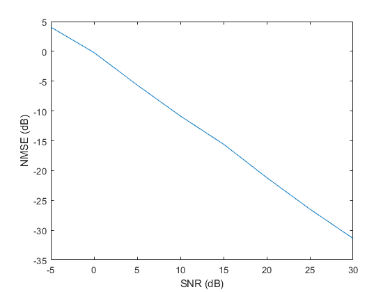

# Variance State Propagation for Structured Sparse Bayesian Learning

This package contains the official implementation of the **variance state propagation (VSP)** algorithm proposed in the paper: 

> M. Zhang, X. Yuan, and Z.-Q. He, “Variance State Propagation for Structured Sparse Bayesian Learning,” *IEEE TRANSACTIONS ON SIGNAL PROCESSING*, vol. 68, pp. 2386–2400, 2020, doi: [10.1109/TSP.2020.2983827](https://doi.org/10.1109/TSP.2020.2983827).

## Introduction

VSP is a robust compressed sensing (CS) algorithm for *block-sparse* signals. It outperforms the previous state-of-art turbo CS and approximate message passing (AMP) methods when the measurement matrices do not met certain requirements. We hope that this repository serves as an easily reproducible baseline for future researches in this area.

## Code Structure

`VSPSolver.m`: VSP implementation function. 

* Arguments:
  * y: measurement vector
  * A: measurement matrix
  * K: number of non-zero coefficients in the signal to be estimated
  * beta & alpha: parameters of the Markov random field

`SOMP2.m`: orthogonal matching pursuit (OMP) solver. Baseline method.

`StdSBLSolver.m`: sparse Bayesian learning (SBL) solver. Baseline method.

`PCSBLSolver.m`: pattern-coupled sparse Bayesian learning (SBL) solver. Baseline method.

`test_VSP.m`: a test demo.

## Citation
```
@ARTICLE{9050837,
  author={M. {Zhang} and X. {Yuan} and Z. {He}},
  journal={IEEE Transactions on Signal Processing}, 
  title={Variance State Propagation for Structured Sparse Bayesian Learning}, 
  year={2020},
  volume={68},
  number={},
  pages={2386-2400},
  doi={10.1109/TSP.2020.2983827}}
```


## Reproducing Results

Run `test_VSP.m` will get the NMSE curve of VSP in Fig. 5(a) of the paper.


